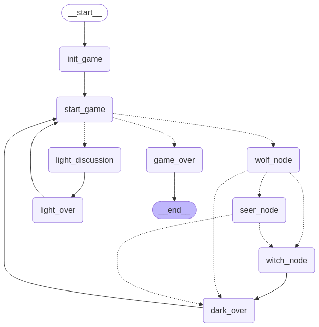

The framework process is as follows

1. Initialize the game (node)

2. Start the game (node)

2.1 Determine if the game has ended

2.2 Determine if it is day or night

3. Night, enter the Werewolf (node)

3.1 If the Seer exists, Werewolf (node) -> Seer (node)

3.2 If the seer does not exist and the witch exists and the witch has skills, Werewolf (node) -> Witch (node)

3.3. If none of the above conditions are met, Werewolf (node) -> Night Summary (node)

4. Seer (node)

Cast a skill to obtain player information (ask the dealer)

Dealer informs information

Seer receives information

4.1 The Witch exists and the Witch has skills  Seer (node) -> Witch (node)

4.2 The above is not valid
